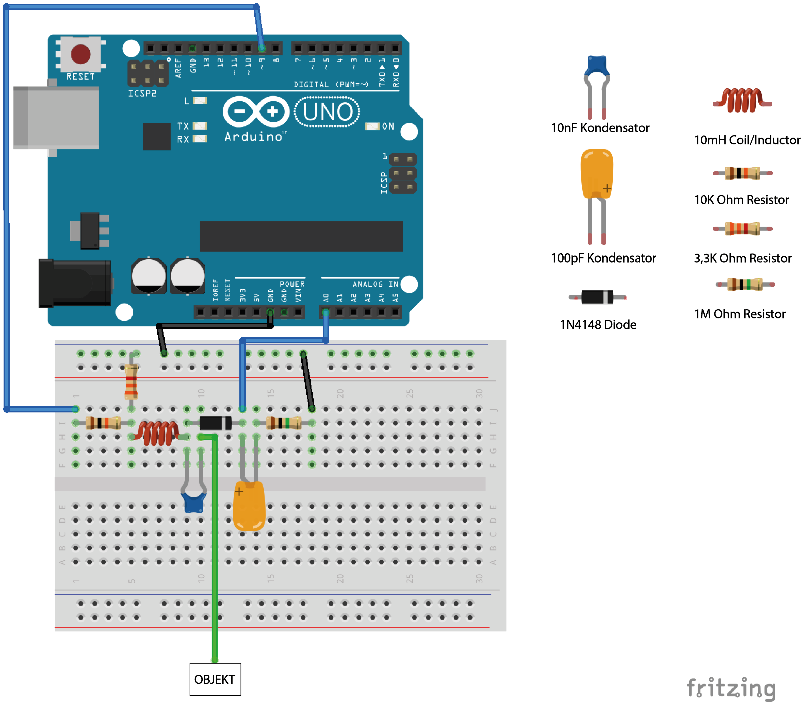
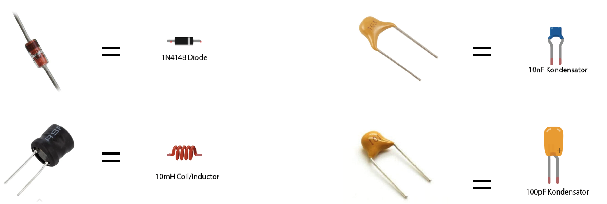
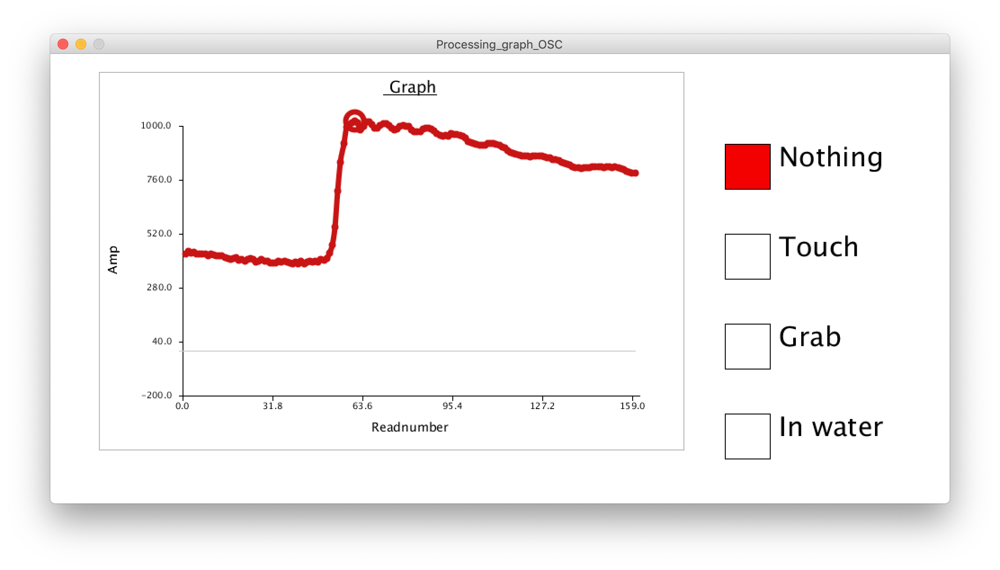
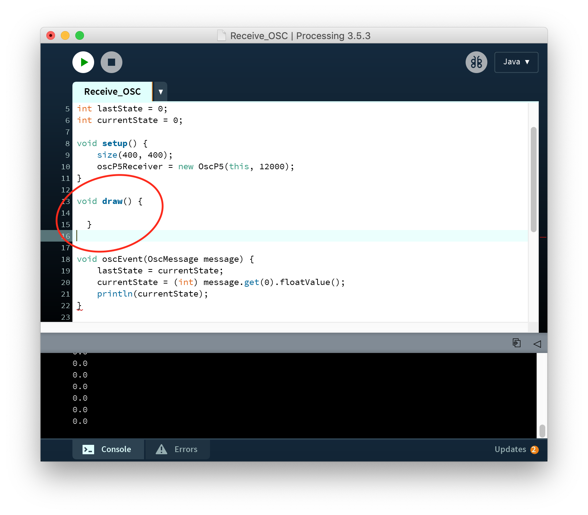
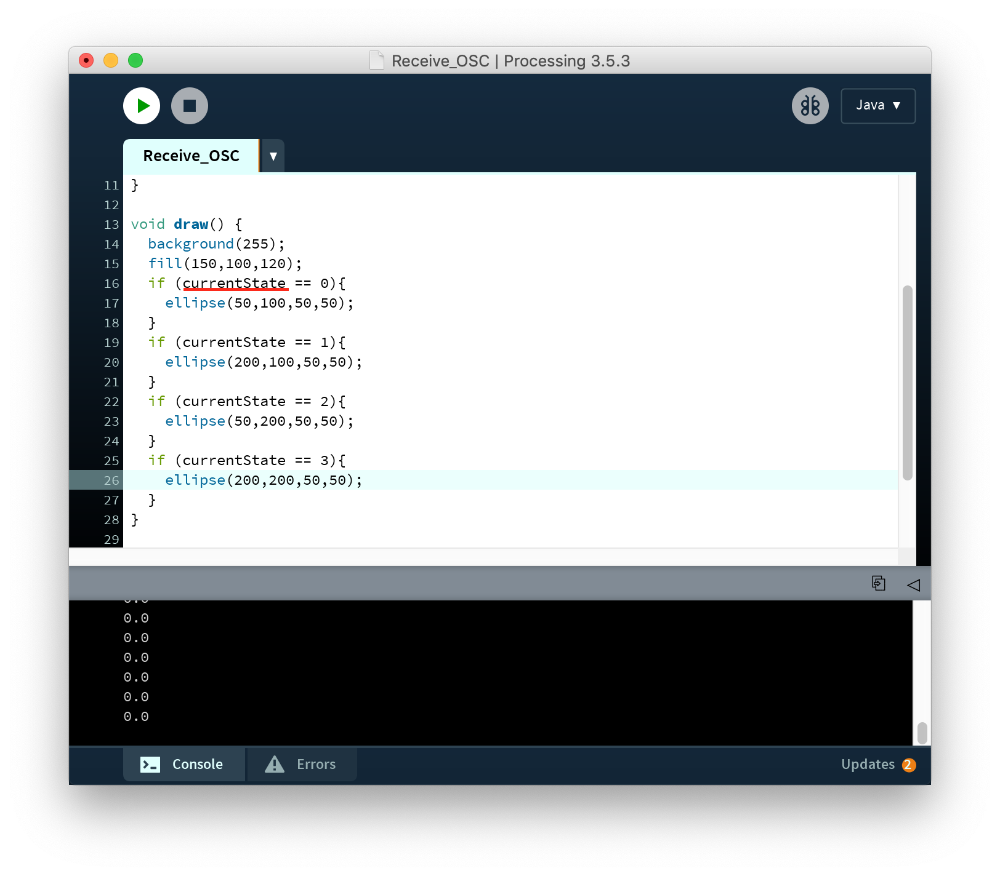

# Guide til Advanced Sensing - Touché

Arduino og Processing kode er lavet af [Mads Hobye](https://www.instructables.com/id/Touche-for-Arduino-Advanced-touch-sensing/)

### 1.
 Start med at downloade repository

### 2.
For at bygge setuppet kan i benytte følgende illustration. Nogle af komponenterne fra illustrationen er vist nederst i denne sektion.

Vi skal bruge følgende komponenter:

- Arduino
- Usb cable
- Jumper cables
- Resister: 10k, 1M, 3,3k Ohm
- Capacitor: 100pf, 10nf
- Diode: 1N4148 diode
- Coil / inductor: 10mH
- A sensing object.

Vær opmærksom på at de rigtige kondensatorer bliver brugt for at der kommer et optimalt frekvensaflæsning.

### 3.
Når i har bygget setuppet kan i tilslutte arduinoen og uploade koden. I kan herefter forsøge at køre testkoden i processing og se om der er udsving. Hvis I ikke har det i forvejen, skal i importere OSC library til processing.

Hvis i ikke har installeret Processing i forvejen kan det hentes [her](https://processing.org/download/).

Inde i processing IDE: Sketch -> Import Library -> Add Library -> Søg på OSCp5 og tryk derefter install.

Når i kører sketchen skal grafen gerne se nogenlunde sådan ud:

### 4.

Herefter kan I tage ledningen der fører til objektet og sætte på fx en plante, frugt eller i en kop med vand. Brug evt. Et krokkodillenæb.

Hvis I oplever en fejl med Serial i processingkoden kan I gentilslutte arduinoen, vente et par sekunder, og køre sketchen igen. Det kan også være at den forkerte port er blevet valgt. Dette kan I ændre i 'Processing_graph_OSC' på linje 19 under 'PortSelected'. I kan se hvilken port i vil benytte jer af, ved at kigge på listen i konsollen når i kører sketchen.

### 5.

Når I har fået processing koden til køre, kan I forsøge at 'træne' sketchen, ved at trykke på firkanterne ved de forskellige tilstande.

Eksempelvis:
* 0 - ingen berøring
* 1 - 1 finger på objektet
* 2 - holder om objektet
* 3 - begge hænder tæt på objektet

### 6.

Hvis I herefter vil bruge jeres gesture inputs i processing kan i benytte jer af filen der hedder Receive OSC. Koden benytter sig af open sound control protokollen til at sende dataen. I skriver jeres sketch i draw og bruger fx. currentState variablen.

I kan eksperimentere mere med koden da OSC er bredt supporteret i forskellige devices og kodemiljøere.
